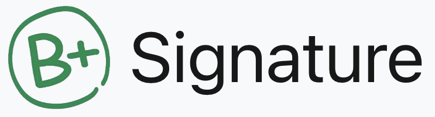

## What it does
The B(e)Signature web application provides a user-friendly way to fill out B+'s financial aid form. It uses DocuSign's eSignature so families can agree to the terms of receiving aid for the patient, with the signer being the parent/legal guardian. It also uses eSignature to receive the patient's medical information, where the signer is a social worker (allows signing separately to make it easy for both parties). Additionally, it holds signing status and patient information in a database, allowing B+ to easily see if both forms were filled out, and also all the information submitted in the forms for each patient. 

__Demo Notes__: Form information is pre-filled, just for demonstration purposes. Try it out by submitting a form, completing a demo eSignature, and viewing data in the admin portal. The website might take ~10s to load, since Heroku Dynos sleep with 30 minutes of inactivity.

## How I built it

This app was created using a React.js frontend, Node + Express backend, and MongoDB database. I felt this was more extensible than purely a full Node + Express application like in the eSignature quickstart. Instead of directly accessing the eSignature API, I used the SDK which simplified creating the signing ceremony with authentication. I then deployed both the client and server under the same domain on Heroku for production.

## Challenges I ran into
- It was difficult to translate the full Node + Express quickstart application into just a backend. This required a lot of refactoring and understanding of the eSignature SDK to see what each line did, but after quite a bit of work I was able to separate the client and server and keep only the code I needed from quickstart.
- Deploying into production was difficult, because I had never done so with a full-stack application. I first tried different hosting services like Netlify and Vercel, but none of them were easily compatible with my backend. I then had to understand how environment variables work, and added/refactored the variables in quickstart ensuring any private information like API keys weren't exposed. After fiddling with Heroku's GitHub integration which didn't work, I ended up using Heroku Git CLI.
- Getting DocuSign's tabs placed with pre-filled values. I first made the fillable fields in the pdf, then tried eSignature's automaticPdfTransform which didn't place the Tabs correctly. Anchor tagging had some duplicate strings and was burdensome, but I eventually used this method to place all the tabs. 

## Accomplishments that I'm proud of
Considering I've never worked with and deployed a client/server architecture before, and also never used Node or MongoDB, I'm happy that the app is running successfully in production along with the eSignature SDK integration. I'm proud of the focus I put on ease of use, minimizing problems and frustrations that already burdened families might face. I'm also proud of writing extensible, readable code, rather than just something that works – I organized the frontend with reusable components and compartmentalized backend functionality. I'm glad the website looks professional and secure too.

## What I learned
I learned how a client/server architecture works, how to communicate with a database, and I now understand the methods to develop and deploy such an application. I also learned how to use DocuSign's eSignature and the other developer tools it offers – I think this skill will be valuable in a variety of situations I face in future careers. I also more deeply understood how to translate a client's business needs into product solutions, as when I reached out to B+ they informed me of problems they faced with paper agreements – this inspired all the features of the application. 

## What's next for B-Signature
- DocuSign ID verification for parents and social workers filling the forms
- Transition into legally binding DocuSign envelopes (currently demo)
- Deleting select patient data in the database
- A better way to search the database that's not case sensitive and by exact name
- More secure admin portal (instead of just password)

## Inspiration
Childhood cancer needs more attention, funding, and research – families with children who have cancer often face difficulties navigating this situation. The Andrew McDonough B+ Foundation helps thousands of families across the country whose children have cancer through direct financial assistance, advocating for research, and awareness. 

Currently, the agreement between family and B+ for financial assistance is done through mail-in forms. I wanted families, who are already burdened enough, to easily submit applications for assistance and have them reviewed __instantly__, providing quick aid for the children who need care urgently. After reaching out to B+, I also discovered sometimes hand-written applications couldn't be read, and all applications were scanned and shredded eventually. I thought a web app containing forms and implementing DocuSign's eSignature would be a great way to make agreements virtually, helping both families who need urgent care and B+. It would also benefit the environment, as no postage is required and documents don't need to be shredded.
